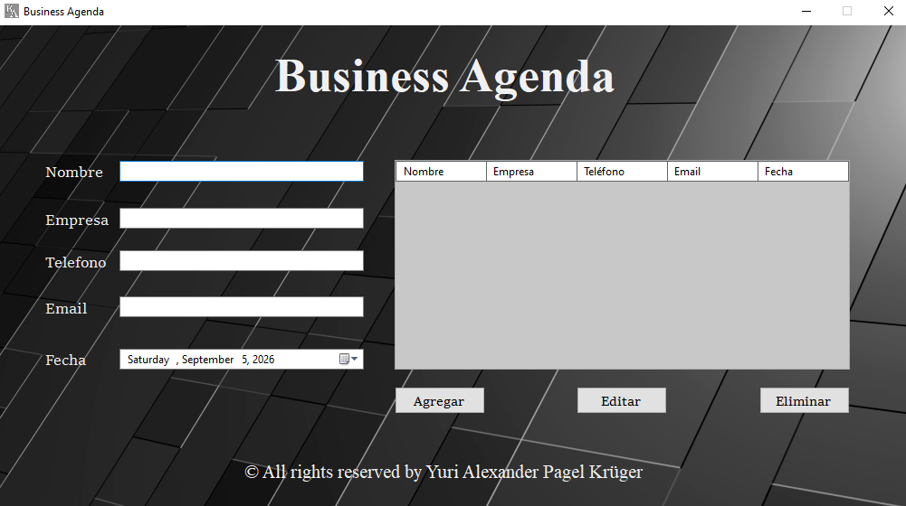
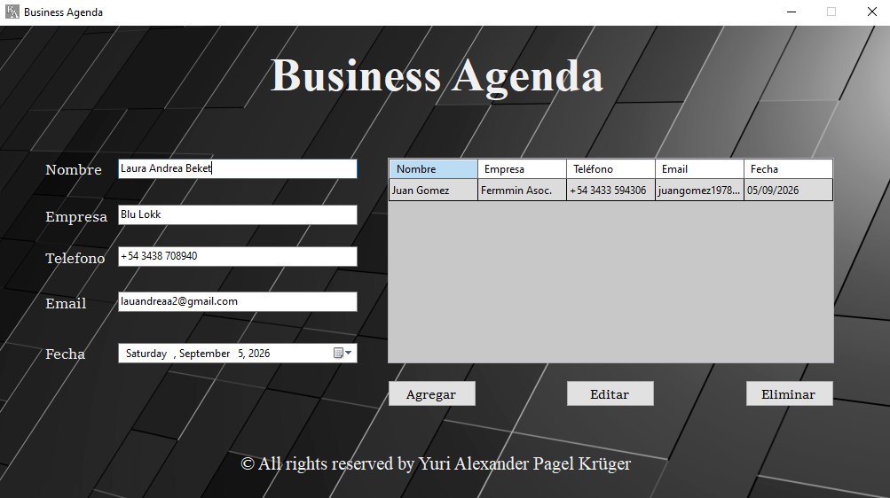

# Business Agenda

**Business Agenda** es una aplicación de escritorio diseñada para la gestión rápida y eficiente de contactos corporativos, desarrollada en Visual Basic .NET. A diferencia de las agendas genéricas, este proyecto combina la funcionalidad esencial de un registro estructurado con un diseño de interfaz (GUI) elegante, oscuro y de estilo corporativo.

Con una interfaz de una sola ventana, el usuario puede gestionar toda su lista de clientes, proveedores o asociados de forma fluida y sin distracciones.

## 📸 Capturas de pantalla

*Pantalla principal con el formulario de ingreso y diseño corporativo oscuro.*

*Vista de la tabla de datos (DataGrid) organizando los registros en tiempo real.*

## ✨ Características Principales

- **Gestión Integral (CRUD):** Funcionalidad completa para **Agregar**, **Editar** y **Eliminar** contactos con solo presionar un botón.
- **Campos Estructurados:** Registro detallado que incluye Nombre, Empresa, Teléfono, Email y Fecha (con selector de calendario interactivo).
- **Diseño Corporativo y Estético:** Interfaz personalizada con un fondo geométrico oscuro y paneles translúcidos que ofrecen un aspecto profesional y moderno.
- **Visualización Inmediata:** Tabla de datos integrada que muestra y actualiza la información de todos los contactos al instante, permitiendo una lectura clara de la agenda.

## ⚙️ ¿Qué hace la aplicación? (Mecánica de uso)

La aplicación funciona como un gestor de bases de datos local interactivo. Al interactuar con la interfaz, el sistema ejecuta las siguientes acciones:

1. **Agregar:** Captura la información de los cuadros de texto y el calendario, la valida y genera un nuevo registro estructurado en la tabla principal.
2. **Editar:** Permite al usuario seleccionar cualquier fila existente en la tabla, volcar sus datos automáticamente de vuelta al formulario, modificar lo que sea necesario y actualizar el registro.
3. **Eliminar:** Remueve de manera instantánea el contacto seleccionado de la lista, ayudando a mantener la agenda limpia y organizada.

## 🛠️ Tecnologías Utilizadas

- **Lenguaje:** Visual Basic .NET (VB.NET)
- **Framework Gráfico:** Windows Forms (.NET Framework)
- **Componentes:** DataGridView, DateTimePicker.
- **Entorno:** Visual Studio.

## 🚀 Instalación y Uso

1. Descarga el instalador desde la sección de **Releases**.
2. Haz doble clic en `Business-Agenda-v1.1.0-Setup.exe` e instalo.
3. Una vez instalado abre el programa, llena los campos del formulario y presiona **Agregar** para empezar a crear tu directorio empresarial.

## 👨‍💻 Autor

Creado por **Yuri Alexander Pagel Krüger** 
© 2026 Yuri Alexander Pagel Krüger. Todos los derechos reservados.
